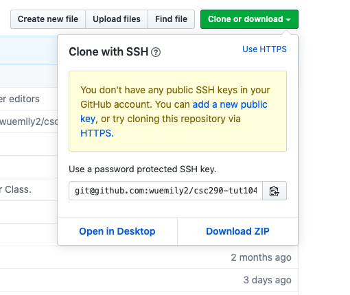
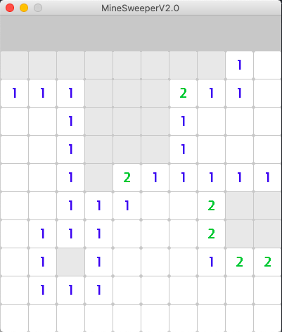
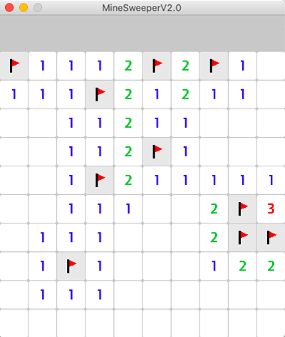

# Minesweeper 2.0
A modern interpretation on the classic Minesweeper game in `Python` using `PyGame`.
## Index
1. [How To Install Minesweeper 2.0](#installing-minesweeper-20)
2. [How To Play Minesweeper 2.0](#playing-minesweeper-20)
3. [Extending Minesweeper 2.0](#extending-minesweeper-20)
4. [Documentation](#documentation)
5. [Authors and Contributions](#authors-and-contributions)
6. [License](#license)

## Installing Minesweeper 2.0
###### For Both Mac and Windows
1. Download [Pygame](https://www.pygame.org/download.shtml) 
2. Click > Clone or Download
3. Click > Download ZIP
4. Unzip the file and run the python file named MinesweeperGUI.py using any IDE
5. Enjoy!

## Playing Minesweeper 2.0
To Play Minesweeper 2.0 the rules of the original minesweeper still apply. We have a table of tiles that can be pressed with your mouse. Some tiles contain bombs underneath, and your goal is to flag them using the right click on your mouse. The game is won when all the bombs have been flagged. If you happen to left click on a tile with a bomb underneath, the game is lost. The number on a tile represents how many bombs are surround it.

## Extending Minesweeper 2.0
  Everyone is free to fork our project and extend to the game anyway you would like. There are pending features like the menu bar, the board size changer and number of bombs changer that are yet to be implemented. The GUI `MinesweeperGUI.py`and the logic class `Board.py`
both support changes to board size and addition of bombs. Some out-of-scope features like menu screen, appearance changer, different types of power ups, hint, etc could be added.

## Documentation
  The Github Directory is structured such that all Python files and the assets folder are located in the root folder of the directory. This directory only contains one folder, which contains the visual PNG assets required for the game as well as the images included in this ReadMe. 
  
  The class responsible for controlling the logical model of Minesweeper is the Board class, located in `Board.py`. This class can be used to generate boards for the Minesweeper game, as the name of the class suggests. All computations on the state of the board occur in the Board class, which utilizes Tile child class objects and Sampler (a class located in `Board.py`) objects. A Board object contains methods to alter its state as well as the states of the Tiles it contains. The Sampler object is used to randomly distribute Tiles in the `create_board()` method. Running the Board class allows the user to play a text version of the game, where the player can type in the console to play the game.
  
  The Tile class, which is utilized heavily in the Board class and located in `Tile.py`, represents the state of a single tile on a Minesweeper board. This class defines the behaviour of a tile when it is revealed, clicked, or flagged. This class also has methods for returning its position, type, and string representation. The behaviour of a Tile when clicked is implemented in the child classes: `BombTile`, `NumberTile`, and `EmptyTile`.
  
  The Python classes TileView and MinesweeperGUI are responsible for running a visual version of the Minesweeper game, as shown in the screenshots. These classes utilize PyGame. The player uses the GUI to play the game.

## Authors and Contributions
#### Kavin Adithiya
> I worked on setting up the repository, adding the `.gitignore` file*, making the assets and the GUI element of the game. I set up the repository with required classes and added the `requirements.txt` file. `The requirements.txt` file is used by the IDE to install the dependencies of the project. I was responsible for implementing the GUI of the game, along with other additional features. I created the `TileView.py` class which helps the `MinesweeperGUI.py`handle updating each tile of the board. I setup the pygame module for the GUI and implemented the entirety of the GUI seen in the current version. I was also incharge of adding the [Extending Minesweeper 2.0](#extending-minesweeper-20) part of the readme file.  
>*The git ignore file was generated online using the website gitignore.io.

#### Sohrab Amin
> In terms of code, I contributed in designing the original Model-View Controller template. We used aspects of the original template in our current production code, with revisions of course. I created the `Minesweeper.py` class and it's corresponding methods and attributes. I used the original template here by creating the empty `__init__`, `update_display()`, `report_game_won()`, `restart()` and `game_loop()` methods. For each method I wrote the appropiate documentation, describing its purpose. Specfically, I implemented the `restart()` method. Unfortunately, we decided to remove the entirety of the `Minesweeper.py` file as it was redundant with other code we wrote. With regards to the README file, I decided to create a collaborative Google Docs file where we can share our ideas about what type of content we want to include. I then wanted to add the content into our actual README where I soon realized it uses a Markdown writing style. Using the markdown style, I added the appropiate headers and filled in the [How to Play Minesweeper](#playing-minesweeper-20) and [License](#license) sections. 

#### Aishah Kabir
> In regards to the coding aspect of the game, I implemented most of Minesweeper Class where we handled updating the display, reporting a game won, restarting the game, and the game loop. This file no longer exists because we realized there were better and more efficient ways to implement these methods instead of in Minesweeper Class. We moved these methods to MinesweeperGUI and Board.py and renamed them as well to things such as `update()`, `start_new_game()`, and `is_game_won()`. In the ReadMe file I created the instructions on how to install our game and revised the file to make sure things were gramatically and technially correct. 
#### Emily Wu
> Emily Wu implemented the completed versions of Board, Sampler, Tile, NumberTile, BombTile, and Empty Tile classes and wrote the documentation of those classes. These classes represent the logical model of the game, which controls the underlying mechanics of the gameplay. She contributed to the ReadMe file by describing the code she implemented under Documentation.
#### Nan Xu
> In terms of code, I initiated three subclasses: `EmptyTile`, `NumberTile` and `BombTile` of the class `Tile` and intended to implement them as the project continues. However, the implementation of these three classes were completed by other teammates without further communication with me. In terms of READEME file, I participated in all communications of constructing the file and I added my contributions in the file.
## License

See the [LICENSE](LICENSE.txt) file for license rights and limitations (MIT).
