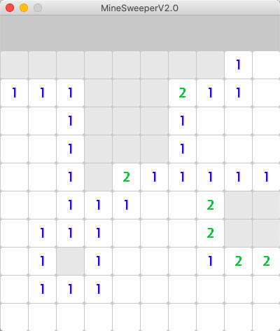

# Minesweeper 2.0
A modern interpretation on the classic Minesweeper game in `Python` using `PyGame`.
## Index
1. [How To Install Minesweeper 2.0](#installing-minesweeper-20)
2. [How To Play Minesweeper 2.0](#playing-minesweeper-20)
3. [Extending Minesweeper 2.0](#extending-minesweeper-20)
4. [Documentation](#documentation)
5. [Authors and Contributions](#authors-and-contributions)
6. [License](#license)

## Installing Minesweeper 2.0
###### For Both Mac and Windows
1. Download [Pygame](https://www.pygame.org/download.shtml) 
2. Click > Clone or Download
3. Click > Download ZIP
4. Unzip the file and run the python file named MinesweeperGUI.py using any IDE
5. Enjoy!

## Playing Minesweeper 2.0
To Play Minesweeper 2.0 the rules of the original minesweeper still apply. We have a table of tiles that can be pressed with your mouse. Some tiles contain bombs underneath, and your goal is to flag them using the right click on your mouse. The game is won when all the bombs have been flagged. If you happen to left click on a tile with a bomb underneath, the game is lost. The number on a tile represents how many bombs are surround it.

## Extending Minesweeper 2.0

## Documentation
## Authors and Contributions
#### Kavin Adithiya
> Insert Contribution
#### Sohrab Amin
> Insert Contribution
#### Aishah Kabir
> Insert Contribution
#### Emily Wu
> Insert Contribution
#### Nan Xu
> Insert Contribution
## License
See the [LICENSE](LICENSE.txt) file for license rights and limitations (MIT).
